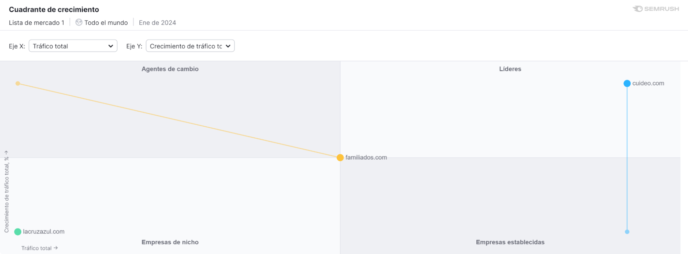


**Autor(es):** **[Márquez González, Diego](../grupo)**

|**Fecha**|**Versión**|
| :-: | :-: |
|05/02/2024|v1.0|
|12/02/2024|V1.1|
|14/02/2024|V1.2|

## Introducción

Hemos estado analizando posibles competidores para nuestra aplicación y hemos encontrado algunos que ofrecen servicios similares a los que ofrecemos, concretamente:

- Familiados: https://familiados.com/
- Msoluciona: https://www.msolucionasevilla.com/ayuda-domicilio-sevilla/?gad_source=1&gclid=EAIaIQobChMIsPDgi9-OhAMVDZKDBx03-QGUEAAYBCAAEgI12_D_BwE
- Cuideo: https://cuideo.com/
- La cruz azul: https://lacruzazul.com/
- Yo Cuido: https://yocuido.es/ https://yocuido.es/servicios
- Qida: https://qida.es/

A continuación vamos a comparar los servicios que ofrecen cada uno de ellos y los vamos a comparar con los que ofrecemos en **CuidaMe**.
## Comparativa

||**CuidaMe**|**Familiados**|**Msoluciona**|**Cuideo**|**La Cruz Azul**|**Yo Cuido**|**Qida**|
| :-: | :-: | :-: | :-: | :-: | :-: | :-: | :-: |
|**Servicios**||Cuidador por horas, internos, acompañamiento casa, acompañamiento hospital, limpieza hogar, cuidado niños|Cuidado a mayores, limpieza hogar, cuidado enfermos, cuidado niños, internos, SAD, Acompañamiento hospital|Cuidadores por horas, internos, SAD, acompañamiento hospital, Trae a tu cuidador|SAD, Psicólogos, Fisioterapia, Urgencias.|Hogar, cuidado mayores y dependientes, Cuidado de niños, ATS, DUE (enfermeros), Fisioterapeuta, Trabajador social, Terapeuta, TASOC (técnico de actividades socioculturales)|Interno, por horas, trae tu cuidador, SAD, Fisioterapia, Logopedia, Podología, Analíticas, Material ortopédico, Medicación a domicilio, Financiación, Asesoramiento ayudas y residencia, acompañamiento a casa.|
|**Clientes**||Particulares, Empresas|Empresas|Particulares|Particulares|Particulares, empresas|Particulares|
|**Permite publicar ofertas**||Sí|Sí mediante teléfono o formulario web.|Sí mediante formulario web y teléfono.|Sí mediante formulario web y teléfono.|Sí|Sí mediante formulario web y teléfono.|
|**Permite darse de alta como cuidador**||Sí|Sí mediante formulario web.|Sí mediante formulario web y teléfono.|No|Sí sólo APP|Sí mediante formulario web y teléfono.|
|**Chat**||Sí|No|No|No|Sí|No|
|**Videollamada**||Sí|No|No|No|No|No|
|**Mapa**||Sí|No|No|No|Sí|No|
|**Buscador**||Sí|No|No|No|Sí|No|
|**Valoración y comentarios**||Sí|No|No|No|Sí|No|
|**Ofrece seguro**||Sí|No|No|No|No|No|
|**Cobertura**||Nacional|Sevilla|Nacional|Nacional|Nacional|Nacional|
|**Duración acompañamientos**||Desde 1 horas hasta 24|Desde 1 horas hasta 24|Desde 1 horas hasta 24|Desde 1 horas hasta 24|Desde 1 horas hasta 24|Desde 1 horas hasta 24|
|**Precios desde**||Plan PRO: 1 semana 3,99€, 9,99€ mes, 29,99 € año|No informa en web|No informa en web|No informa en web|Servicio basic 6€, Servicio Prime Express 67€, Servicio Élite 170€|No informa en web|
|**Cobros online**||Sí|No|No|No|Sí|No|
|**Gestiona gastos extra online (taxis..)**||Sí|No|No|No|No|No|
|**Gestiones**||Directamente desde la web|Teléfono formulario web.|Teléfono formulario web|Teléfono formulario web|Directamente desde la web|Teléfono, formulario web|
|**Teleasistencia**||Sí|No|Sí|No|Sí|Sí|

## Situación en el Mercado

