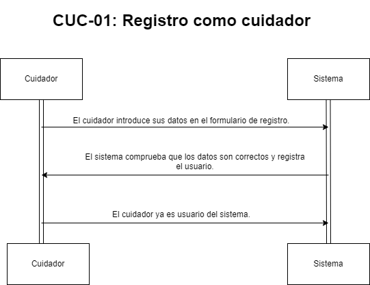
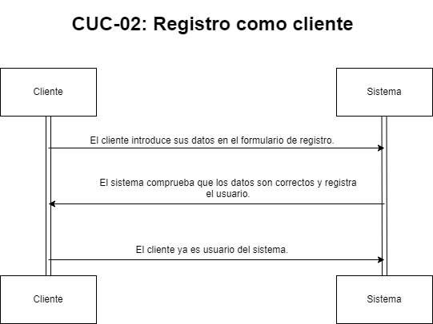
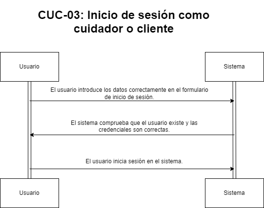
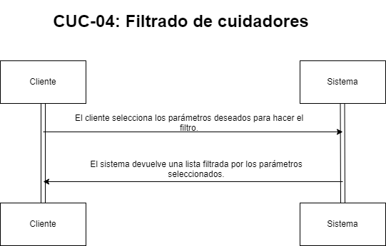
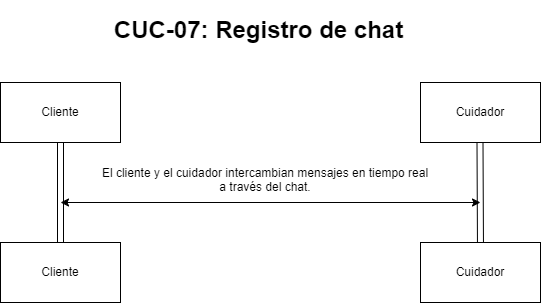
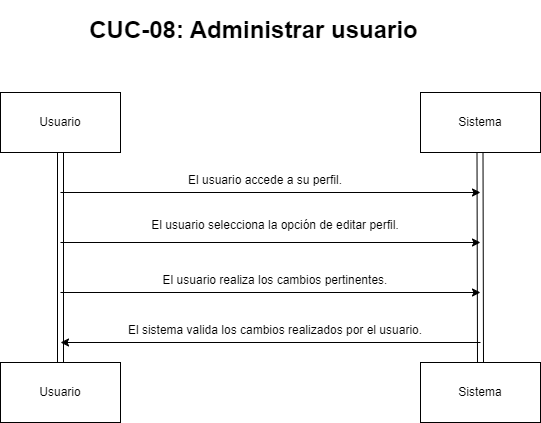

**Autor(es):** **[Diañez Suárez, Daniel](../grupo)**

|**Fecha**|**Versión**|
| - | - |
|24/02/2024|V1.0|

## Introducción
En este documento, exploraremos los diagramas de secuencia de casos de uso core, una herramienta crucial en el diseño de sistemas de software. Estos diagramas ofrecen una representación visual de las interacciones clave entre actores y sistemas en escenarios centrales de uso. A través de ejemplos prácticos, aprenderemos a crear y entender eficazmente estos diagramas, fundamentales para el desarrollo de software.

## Diagrama de secuencias

